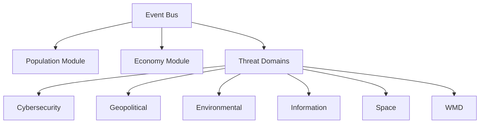
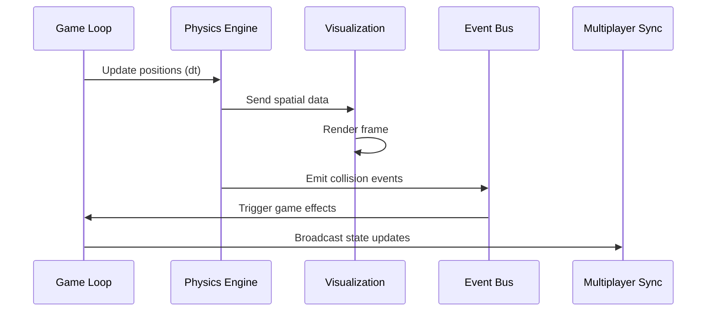
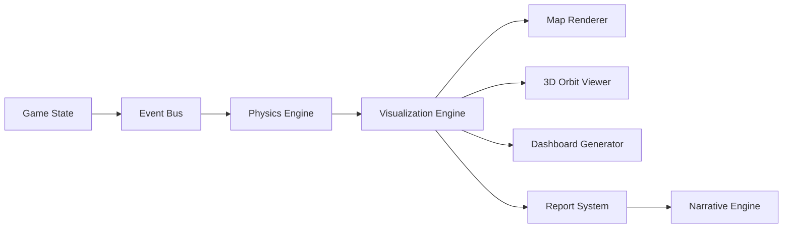
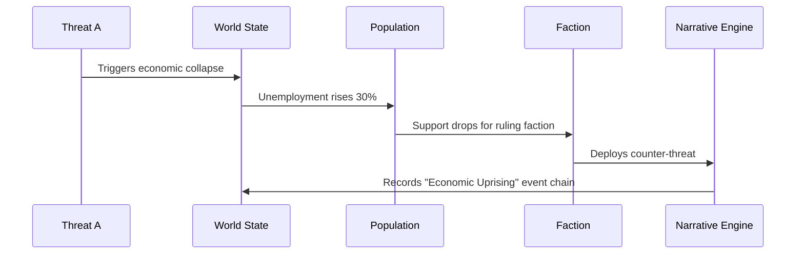

# Unified Systems Documentation

This document consolidates all system-level documentation for ThreatForge, covering the game engine, graphics systems, multiplayer framework, narrative engine, educational integration, user interface, and world simulation in a unified reference.

## Core Game Engine

### Modular Architecture

The ThreatForge engine is built on a highly modular, plugin-based architecture that enables extensible threat simulation across multiple domains.



#### Key Engine Components

- **Event Bus**: Central Publish/Subscribe system enabling decoupled communication between modules
- **Domain Plugins**: JSON-manifest-defined plugins for each threat domain with cross-domain hooks
- **Procedural Generators**: Seed-based algorithms for dynamic world creation and threat evolution
- **Scripting API**: Robust API for custom scripts and mod development
- **Plugin System**: High-performance extension framework supporting community content
- **Emergent Narrative Engine**: AI-driven system for dynamic event chains and chronicles

### Performance Optimization

- **Spatial Partitioning**: Quadtree (2D) and Octree (3D) for efficient entity management
- **Level of Detail (LOD)**: 4-tier quality scaling from full detail to minimal imposters
- **WebGPU Acceleration**: Modern GPU compute for visualization and physics
- **Frame Budget**: Strict 16ms target with dynamic quality scaling
- **Dedicated Physics Threads**: Web Worker offloading for complex simulations

### Physics Integration



## 3D Graphics and Visualization

### Rendering Pipeline

The ThreatForge visualization system provides comprehensive 3D rendering capabilities optimized for complex global threat simulations.

#### Core Visualization Components

1. **World Map View**: Primary 3D globe interface
   - Spherical geometry with dynamic texture mapping
   - Real-time terrain generation using Perlin noise
   - Atmospheric scattering and space rendering
   - Dynamic lighting with day/night cycles

2. **Contextual Data Layers**:
   - **Heatmap Layers**: Visualize threat concentration and intensity
   - **Faction Control Regions**: Dynamic border visualization
   - **Resource Flow Vectors**: Animated resource movement patterns
   - **Military Unit Positions**: Real-time unit locations and trails
   - **Satellite Orbits**: Real-time orbital mechanics visualization

3. **Domain-Specific Dashboards**:
   - **Threat Evolution Trees**: Branching pathways of threat mutations
   - **Risk/Reward Matrices**: Action evaluation matrices
   - **Timeline Projections**: Future threat progression forecasts
   - **Faction Consoles**: Asymmetric faction-specific interfaces

#### Data Flow Architecture



### Special Effects Systems

- **Particle Systems**: Explosions, weather, threat propagation
- **Shader Effects**: Quantum state visualization, radiological glow
- **Animation Systems**: Smooth transitions and threat evolution
- **Post-Processing**: Atmospheric effects, screen-space reflections

## Multiplayer Framework

### Network Architecture

ThreatForge implements a robust multiplayer system supporting both competitive and cooperative gameplay modes.

#### Matchmaking System

- **Skill-Based Matching**: ELO rating system for balanced competition
- **Role Specialization**: Faction-based team formation
- **Dynamic Difficulty**: AI adjustment based on collective player skill
- **Cross-Progression**: Cloud-saved progress across devices
- **Quantum-Secure Networking**: End-to-end encryption with QKD protocols
- **Latency Compensation**: Physics-aware netcode for smooth interactions

#### Game Modes

**Competitive Play**:
- Asymmetric objectives with distinct win conditions
- Resource wars for strategic region control
- Espionage mode for intelligence operations
- Alliance politics with dynamic diplomacy
- Quantum computing races for technological supremacy
- Robotic warfare arenas for PvP tactical combat

**Cooperative Play**:
- Shared objectives requiring coordinated efforts
- Specialized roles with complementary abilities
- Distributed threats needing multi-domain responses
- Collective narratives with branching outcomes
- Cross-domain synergy for amplified effects
- Quantum entanglement coordination for advanced scenarios

#### Multiplayer Event System

```typescript
interface MultiplayerEvent {
  id: string;
  type: 'THREAT' | 'DIPLOMACY' | 'DISASTER' | 'TECH_BREAKTHROUGH';
  participants: string[];
  requiredRoles: FactionType[];
  timeLimit: number;
  successConditions: {
    threshold: number;
    metrics: ('DAMAGE' | 'CONTROL' | 'KNOWLEDGE')[];
  };
  rewards: {
    factionResources: Record<FactionType, ResourcePool>;
    unlockables: string[];
  };
}

interface QuantumLinkedEvent extends MultiplayerEvent {
  entanglementLevel: number;
  requiredSynchronization: number;
}
```

## Narrative Engine

### Dynamic Story Generation

The AI-driven Narrative Engine creates emergent storylines by chaining events into complex chronicles that respond to player actions and simulation outcomes.

#### Event Chaining System



#### Chronicle Generation

- **Input**: Event chains with 3+ causally linked events
- **Process**: 
  1. Classify event types and themes
  2. Determine narrative archetype (Betrayal, Revolution, Redemption, Escalation)
  3. Generate evocative titles incorporating threat domains
  4. Create detailed narrative summaries

```typescript
interface NarrativeChain {
  id: string;
  title: string;
  timeline: string[];
  primaryFactions: FactionType[];
  globalImpact: number;
  keyOutcomes: string[];
  domainsInvolved: ThreatDomain[];
  turningPoint: string;
  resolution: 'POSITIVE' | 'NEGATIVE' | 'NEUTRAL';
  duration: number;
  quantumEntanglement?: number;
  radContamination?: number;
  roboticAutonomy?: number;
}
```

#### Event Weighting System

Events are dynamically weighted based on severity, cross-domain impacts, and domain-specific properties:

```typescript
function calculateEventWeight(event: Event): number {
  let weight = (event.severity * 0.6) +
               (event.crossDomainImpacts.length * 0.3) +
               (event.factionsInvolved.length * 0.1);

  // Domain-specific modifiers
  if (event.domainsInvolved.includes("QUANTUM") && event.quantumCoherence) {
    weight *= 1 + (event.quantumCoherence * 0.3);
  }
  if (event.domainsInvolved.includes("RAD") && event.radHalfLife) {
    weight *= 1 + (1 - Math.exp(-0.01 * event.radHalfLife));
  }
  if (event.domainsInvolved.includes("ROBOT") && event.roboticAutonomy) {
    weight *= 1 + (event.roboticAutonomy * 0.4);
  }

  return Math.min(2.0, weight);
}
```

## Educational Integration

### Real-World Parallels System

The educational integration system provides real-world context and historical comparisons for enhanced learning.

```typescript
class EducationalModule {
  constructor(threat: Threat) {
    this.realWorldCases = Database.matchHistorical(threat);
  }

  displayComparisons() {
    return {
      timeline: 'Side-by-side event progression',
      mitigation: 'Historical success/failure rates',
      physics: 'Real-world vs simulated propagation',
    };
  }
}

// Example binding:
new Threat().onDetect(() => {
  const edu = new EducationalModule(this);
  ui.showEducationalOverlay(edu.displayComparisons());
});
```

### Educational Features

- **Historical Comparisons**: Side-by-side event progression analysis
- **Mitigation Learning**: Historical success/failure rate data
- **Physics Validation**: Real-world vs simulated propagation models
- **Interactive Tutorials**: Context-sensitive guidance system
- **Scenario-Based Learning**: Progressive challenge-based education
- **Learning Analytics**: Track educational progress and understanding

## User Interface System

### Adaptive UI Framework

The ThreatForge UI dynamically adjusts based on game state, player actions, and emerging threats.

#### Core UI Components

1. **Context-Sensitive Controls**: Auto-adjusting interface highlighting relevant controls
2. **Threat Prioritization**: Dynamic ranking and alert system for critical threats
3. **Decision Support**: AI-assisted recommendations with risk analysis
4. **Historical Comparison**: Current vs past similar events analysis
5. **Multi-Faction View**: Simultaneous multiple faction perspectives

#### Augmented Reality Mode

- **Geospatial Visualization**: Real-world map overlay with game elements
- **Threat Projections**: Dynamic AR threat simulations in real locations
- **Unit Control**: AR-based unit deployment and command
- **Data Layering**: Toggleable information layers (economic, population, environmental)
- **Collaborative Mode**: Shared AR workspace for team strategy

#### Accessibility Features

- **Color Mode Switching**: 6+ color schemes including color-blind friendly options
- **Text-to-Speech**: Full narration of all game text and events
- **Keyboard Navigation**: Complete keyboard-only control support
- **Customizable Controls**: Full input remapping capability
- **Difficulty Scaling**: Adjustable challenge levels without core mechanic changes

## World Simulation System

### Planetary Scale and Generation

The ThreatForge world simulation operates at a ~50 km radius (~31,400 km² surface) with dynamic scaling based on hardware capabilities.

#### Generation Specifications

- **Voxel Resolution**: 1m³ base (configurable to 2m³ for performance)
- **Memory Target**: <4GB for entire planet via sparsity optimization
- **Load Time**: <30 seconds for initial world generation
- **Update Limits**: 100-500 voxels per frame for dynamic changes

#### Planetary Structure

- **Orbit**: 2-5 km thick with 1-2% voxel occupancy
- **Atmosphere**: 3-5 km thick with 2D heightmap projection
- **Surface**: 50-100m thick with 3-4 noise octaves for biomes
- **Underground**: 5 km depth cap with zoned loading for D.U.M.B.s

#### Entity Management

| Entity Type | Count Limit | Update Rate | Optimization |
|-------------|-------------|-------------|--------------|
| Static Deployables | 1,000-5,000 | Event-driven | Pre-baked meshes |
| Mobile Units | 1,000-5,000 | 0.5-30 Hz | LOD behaviors, squad aggregation |
| Orbital Assets | 100-500 | 1-5 Hz | Simplified physics, GPU compute |
| Biological Entities | 500-2,000 | 1-10 Hz | Flock simulations, off-screen culling |

### Environmental Systems

#### Dynamic Weather System

```typescript
interface WeatherSystem {
  currentConditions: {
    type: "CLEAR" | "RAIN" | "SNOW" | "STORM" | "DUST_STORM" | "FLOOD" | "ACID_RAIN" | "RADIOLOGICAL_FALLOUT";
    intensity: number;
    duration: number;
  };
  effects: {
    visibilityModifier: number;
    movementPenalty: number;
    threatAmplification: Array<{domain: ThreatDomain; multiplier: number}>;
    cyberDisruption?: number;
    radiologicalSpread?: number;
    roboticMalfunction?: number;
  };
  forecast: WeatherForecast[];
}
```

#### Physics Modeling

- **Newtonian Mechanics**: Realistic unit movement and interactions
- **Orbital Mechanics**: Accurate satellite trajectory simulation
- **Quantum Physics**: Quantum state representation and decoherence
- **Energy Systems**: Unit power consumption and generation models
- **Cross-Domain Physics**: Integrated multi-domain interaction models

### World State Representation

```typescript
interface WorldState {
  regions: Region[];
  factions: Faction[];
  currentTurn: number;
  globalMetrics: {
    stability: number;
    economy: number;
    trust: number;
  };
}
```

## Cross-Domain Integration

### Interaction Matrix

| Domain Pair | Interaction Effect | Example |
|-------------|-------------------|---------|
| Cyber + Info | 1.5x disinformation spread | AI-generated deepfakes accelerate propaganda |
| Env + Geo | 2.0x migration effects | Drought triggers border conflicts |
| Quantum + Cyber | 3.0x decryption | Quantum computers break encryption in hours |
| Rad + Env | 1.8x contamination | Dirty bombs create long-term ecological damage |
| Robot + Cyber | 2.5x autonomy | Hacked robots turn against owners |
| Neuro + Quantum | 3.2x cognitive impact | Quantum-entangled neural networks |

### Emergent Behavior System

The unified systems framework enables complex emergent behaviors through component interactions:

```typescript
function calculateCrossImpact(threatA: Threat, threatB: Threat): number {
  const baseEffect = threatA.severity * threatB.severity;
  const domainMultiplier = DOMAIN_MATRIX[threatA.domain][threatB.domain];
  const synergy = threatA.crossDomainImpacts
    .find(i => i.domain === threatB.domain)?.multiplier || 1.0;
  const regionModifier = calculateRegionModifier(threatA.region, threatB.region);
  const timeFactor = Math.exp(-0.1 * Math.abs(threatA.age - threatB.age));
  
  return baseEffect * domainMultiplier * synergy * regionModifier * timeFactor;
}
```

This unified systems documentation provides comprehensive coverage of all ThreatForge systems while maintaining focus on emergent behaviors and cross-domain interactions that create complex, unpredictable gameplay scenarios.