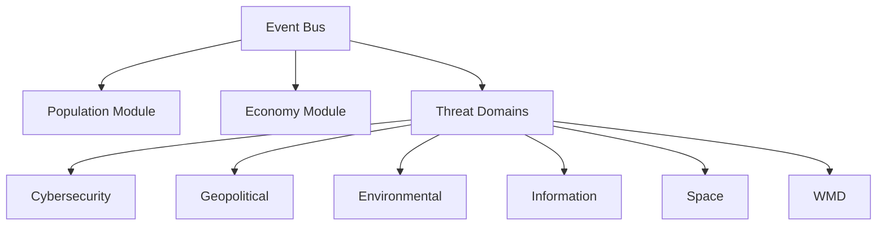
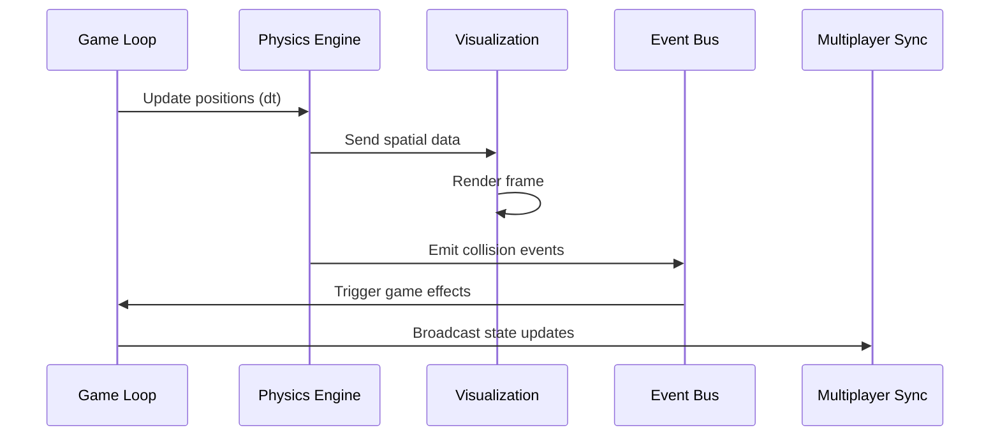

# Core Architecture

This document outlines the fundamental architecture and technical specifications of the ThreatForge game engine. It details the modular design, key components, extensibility features, and performance considerations that enable the simulation of complex global threats.

## Modular Structure

## Key Components

The ThreatForge engine is built upon several interconnected components that facilitate its modularity, simulation capabilities, and extensibility:

- **Event Bus**: A central Publish/Subscribe (Pub/Sub) system that enables decoupled communication between different modules and components. This ensures that changes in one part of the engine do not directly impact others, promoting flexibility and maintainability.
- **Domain Plugins**: Each threat domain (e.g., Cyber, Bio, Geo) is implemented as a plugin, defined by JSON manifests. These manifests specify:
    - **Threat Types**: Definitions of specific threats within the domain (e.g., "Ransomware" in Cyber).
    - **Mechanics**: Rules and algorithms governing how threats within that domain behave, propagate, and interact.
    - **Cross-domain Hooks**: Integration points that allow threats from one domain to influence or be influenced by events in other domains, facilitating complex emergent behaviors.
- **Procedural Generators**: Seed-based algorithms that create dynamic and varied content for the simulation, ensuring high replayability and emergent scenarios. These generators are responsible for:
    - **World Creation**: Generating diverse geographical landscapes, resource distributions, and initial conditions for the simulation environment.
    - **Threat Evolution Trees**: Creating branching pathways for how threats can mutate, adapt, and develop new properties over time.
    - **Narrative Branches**: Constructing dynamic storylines and event chains that respond to player actions and simulation outcomes.
- **Scripting API**: A robust Application Programming Interface that allows developers and modders to extend engine functionality using custom scripts. This API provides access to core engine features, enabling the creation of new threats, mechanics, and interactive elements.
- **Plugin System**: A comprehensive framework that supports the integration of community-created content and high-performance extensions. Plugins are defined via JSON manifests and can introduce new assets, behaviors, and even custom physics simulations.
- **Emergent Narrative Engine**: An AI-driven system that dynamically generates event chains and chronicles based on simulation outcomes and player interactions. This engine ensures a unique and evolving storyline for each playthrough, reacting to the complex interplay of threats and countermeasures.

## Extensibility

The ThreatForge engine is designed with a strong emphasis on extensibility, allowing for seamless integration of new content, features, and community-driven modifications. This plugin-based architecture ensures that the simulation can evolve and expand without requiring core engine modifications.

- **Modular Structure**: The engine's core modules operate independently, communicating through a central event bus (implementing a Publish/Subscribe pattern in JavaScript). This design allows for new modules to be easily integrated by defining specific hooks (e.g., "onTurnEnd" events) in their JSON manifests, enabling flexible and scalable development.
- **Scripting and Modding API**: A powerful API exposes core engine functions, allowing modders and developers to write custom scripts. This enables the creation of entirely new threat types (e.g., `addThreatType({name: "AI Nanobots", effects: [...]})`), custom mechanics, and the import of various assets (e.g., JSON for data, SVG/PNG for visuals), fostering a rich modding ecosystem.
- **Procedural Generation Framework**: The engine incorporates a robust framework for procedural content generation, utilizing seed-based algorithms. This enables the creation of infinite variations for game elements, such as complex world maps using Perlin noise or dynamic narrative branches generated via L-systems, ensuring high replayability and emergent gameplay.
- **Plugin System**: Beyond basic scripting, the plugin system supports high-performance extensions, such as custom physics simulations or advanced AI behaviors. This system is designed to facilitate community mod support, allowing for deep customization and expansion of the game's core functionalities.
- **Open-Source Licensing**: ThreatForge is released under the MIT license, promoting open development and community contributions. The project is forkable on GitHub, and adheres to semantic versioning for API changes, ensuring compatibility and clear communication for developers.

### Extensibility Examples:

- **Add New Factions**: Modders can introduce entirely new factions (e.g., "Alien Invaders," "Benevolent AI") with unique capabilities, objectives, and custom user interfaces, allowing for diverse gameplay scenarios.
- **Overhaul Visuals**: The engine supports comprehensive visual overhauls. For instance, a plugin could switch the entire rendering pipeline to 3D using libraries like Three.js, enabling highly detailed and immersive graphical experiences.
- **Integrate External Data**: The modding API allows for the integration of real-world data sources. This could include fetching live genome data from external APIs for biological threat simulations or incorporating real-time economic indicators to influence in-game markets.

# Technical Specifications

This section details the underlying technical choices and considerations for the ThreatForge engine, covering implementation specifics, performance optimization strategies, and ethical guidelines.

## Implementation Details

- **Frontend/Backend Architecture**: ThreatForge is implemented as an HTML/JavaScript Progressive Web App (PWA), ensuring broad accessibility and offline capabilities. Intensive physics and threat simulations are offloaded to Web Workers, preventing UI freezes and maintaining responsiveness. For 3D rendering, the engine leverages Three.js, providing a powerful and flexible framework for complex visualizations.
- **Performance/Balancing**:
    - **Optimized Physics Interactions**: The engine is meticulously optimized to handle complex physics interactions across various threat domains, ensuring realistic propagation and emergent behaviors without sacrificing performance.
    - **AI-tuned Emergence**: Artificial intelligence algorithms are employed to dynamically tune the emergence of threats and events, ensuring a challenging yet balanced gameplay experience.
    - **Spatial Partitioning**: For efficient management of entities in large-scale simulations, the engine utilizes spatial partitioning techniques: a quadtree for 2D environments and an octree for 3D environments. This significantly improves collision detection and entity querying performance.
    - **Level of Detail (LOD) Rendering**: To maintain high frame rates across diverse hardware, the rendering system implements 4 quality levels of LOD, dynamically adjusting the complexity of rendered objects based on their distance from the camera.
    - **WebGPU Acceleration**: Visualization rendering is accelerated using WebGPU, a modern web graphics API that provides high-performance access to GPU capabilities, enabling rich and detailed visual effects.
    - **Frame Budget**: The engine targets a strict 16ms frame budget (60 FPS) with dynamic quality scaling. If performance drops, the engine automatically adjusts visual fidelity to maintain a smooth user experience.
    - **Dedicated Physics Threads**: Complex simulations, such as robotic swarm behaviors, are offloaded to dedicated physics threads, ensuring that these computationally intensive tasks do not impact the main game loop's performance.
- **Ethics/Accessibility**:
    - **Disclaimers**: Clear disclaimers are provided to inform users about the sensitive nature of the simulated content and to distinguish it from real-world events.
    - **Inclusive Modes**: The engine includes various inclusive modes to cater to diverse user needs and preferences.
    - **Content Warnings**: Explicit content warnings are displayed for sensitive topics or scenarios that may be distressing to some users.
    - **Color-blind Friendly Visualizations**: Visual elements are designed with color-blind accessibility in mind, ensuring that critical information is conveyed effectively to all users.
    - **Educational Mode**: An optional educational mode provides real-world parallels, historical references, and factual context to enhance the learning experience and promote critical thinking.
    - **Privacy-Preserving Analytics**: User analytics are collected with strict privacy-preserving measures and require explicit opt-in consent, ensuring user data is handled responsibly.
    - **Quantum Ethics Guidelines**: Specific guidelines are integrated to ensure the responsible simulation of quantum threats, addressing potential ethical implications and promoting awareness.

## Development and Deployment

This section outlines the development lifecycle and deployment strategies for the ThreatForge engine.

- **Roadmap**:
    - **v1.0 Core Domains**: The initial release focuses on establishing robust simulations for core threat domains, including cyber, biological, geopolitical, environmental, information, space, WMD, quantum, and robotic threats.
    - **Expansions via Mods**: Future content and new threat domains will primarily be introduced through community-driven modifications and official expansions, leveraging the engine's extensibility.
- **Testing**:
    - **Emergence, Balance, and Physics Accuracy**: Rigorous testing is conducted to ensure the accurate simulation of emergent behaviors, game balance across various scenarios, and the precision of physics interactions.
    - **Automated Testing for Cross-Domain Interactions**: Automated test suites are in place to verify the correct and expected interactions between different threat domains, ensuring the integrity of complex simulations.
    - **Playtests for Emergence**: Extensive playtesting is performed to observe and refine emergent gameplay scenarios, identifying unforeseen interactions and balancing issues.
- **Deployment**:
    - **Browser-installable PWA**: ThreatForge is designed as a Progressive Web App, allowing users to install it directly from their web browser and run it offline, providing a seamless and accessible experience.
    - **Optional Electron Wrapper**: For desktop users who prefer a native application experience, an optional Electron wrapper is provided, bundling the PWA into a standalone executable.

## Physics in Game Loop

The following sequence diagram illustrates the interaction between the Game Loop, Physics Engine, Visualization, Event Bus, and Multiplayer Synchronization components during a typical game frame. This flow ensures that physics calculations are performed efficiently, visual updates are rendered smoothly, and game state is synchronized across clients.

**Sequence Explanation:**

1.  **Game Loop (G) -> Physics Engine (P):** The main game loop initiates a physics update, passing the delta time (`dt`) to the Physics Engine to advance the simulation.
2.  **Physics Engine (P) -> Visualization (V):** After updating positions and resolving collisions, the Physics Engine sends relevant spatial data (e.g., object positions, orientations) to the Visualization component.
3.  **Visualization (V) -> Visualization (V):** The Visualization component then uses this spatial data to render the current game frame, drawing all objects and effects.
4.  **Physics Engine (P) -> Event Bus (E):** The Physics Engine emits events related to physics interactions, such as collisions or triggers, to the central Event Bus.
5.  **Event Bus (E) -> Game Loop (G):** The Event Bus relays these physics-related events back to the Game Loop, which then triggers corresponding game effects (e.g., damage calculation, sound effects).
6.  **Game Loop (G) -> Multiplayer Sync (M):** Finally, the Game Loop broadcasts relevant state updates to the Multiplayer Synchronization component, ensuring that all connected clients have a consistent view of the game world.

## Spatial Event Examples

Spatial events are interactions that occur based on the proximity or location of entities within the simulation environment. These events are crucial for triggering localized effects, combat, intelligence gathering, and other geographically dependent mechanics. The table below provides examples of such events and their conditions and effects.

| Event Type        | Condition                                                               | Effect                                                                                                                                              |
| :---------------- | :---------------------------------------------------------------------- | :-------------------------------------------------------------------------------------------------------------------------------------------------- |
| Satellite pass    | A surveillance satellite passes over a specific region.                 | **+Intel gathering**: Increases intelligence gathering capabilities for that region, revealing hidden threats or activities.                        |
| Unit collision    | Two or more military units occupy the same spatial cell.                | **Combat initiated**: Triggers a combat encounter between the involved units, resolving based on their stats and tactics.                           |
| Threat detection  | A threat enters the sensor range of a friendly unit or facility.        | **Visibility increased**: The threat's visibility to the player or allied factions increases, allowing for better tracking and response.            |
| Orbital strike    | A weaponized satellite is positioned directly over a target region.     | **Regional damage**: Inflicts significant damage to the specified region, affecting infrastructure, population, or resources.                       |
| Economic collapse | The stability of a region falls below a critical threshold (e.g., 20%). | **Faction resource penalty**: The controlling faction suffers a severe penalty to its resources, representing the economic fallout of the collapse. |
