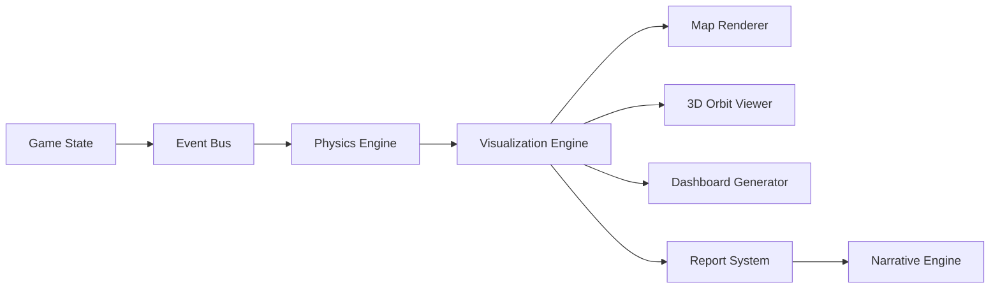

# Data Visualization System

This document describes the data visualization system within ThreatForge, focusing on how complex simulation data is rendered and presented to the user through various UI components. It also details the spatial capabilities of different factions and the costs associated with deploying their units.

## UI Components

1.  **World Map View**: The primary visual interface for observing global simulation progress. It provides a comprehensive overview of the world state through various interactive layers:
    - **Heatmap Layers**: Visualizes the concentration and intensity of different threat types across the globe, allowing for quick identification of hotspots.
    - **Faction Control Regions**: Displays dynamically updated borders indicating areas controlled by various factions, reflecting geopolitical shifts.
    - **Resource Flow Vectors**: Animated lines showing the movement of critical resources between regions, highlighting supply chain dynamics and vulnerabilities.
    - **Military Unit Positions and Movement Trails**: Renders the real-time locations of military units, along with their historical movement paths and velocity vectors, for strategic analysis.
    - **Satellite Orbits and Ground Tracks**: Visualizes real-time orbital mechanics of satellites, including their trajectories and the areas they cover on the ground.
    - **3D Terrain with Dynamic Lighting**: Presents a realistic three-dimensional representation of the world's topography, enhanced with dynamic lighting to reflect time of day and environmental conditions.
    - **Threat Propagation Vectors**: Animated flow fields illustrating how threats are spreading across the map, providing insights into their propagation patterns and potential future impact.

2.  **Domain Dashboards**: Dedicated interfaces providing in-depth analysis and specific data visualizations for each threat domain. These dashboards offer granular insights into the mechanics and progression of threats.
    - **Threat Evolution Trees**: Visualizes the branching pathways of threat mutations and adaptations, showing how threats can evolve into new variants.
    - **Risk/Reward Matrices**: Presents a matrix evaluating the potential risks and rewards associated with different actions or countermeasures within a specific domain.
    - **Timeline Projections**: Displays future projections of threat progression and impact based on current simulation data and predictive models.

3.  **Faction Consoles**: Unique user interfaces tailored to each playable faction, providing specialized tools and information relevant to their roles and capabilities. This ensures an asymmetric gameplay experience.
    - **Technocrat Faction**: Features advanced threat deployment panels, allowing for precise control over the initiation and management of technological and cyber threats.
    - **Mitigator Faction**: Provides sophisticated investigation tools and countermeasure deployment interfaces, focusing on threat detection, analysis, and neutralization.
    - **Nation-State Faction**: Offers diplomatic interfaces, military command controls, and geopolitical intelligence dashboards for managing international relations and conventional warfare.

## Data Flow

The following flowchart illustrates the high-level data flow within the ThreatForge engine, from the core game state to various visualization and reporting systems. This flow ensures that simulation data is processed, rendered, and presented efficiently to the user.



**Explanation of Data Flow:**

- **Game State (G)**: The central repository of all current simulation data, including threat statuses, faction resources, unit positions, and environmental conditions.
- **Event Bus (E)**: A communication hub that broadcasts events and data changes from the Game State to various interested modules.
- **Physics Engine (P)**: Processes physical interactions, movement, and propagation of threats and units based on data received from the Event Bus.
- **Visualization Engine (V)**: Receives processed data from the Physics Engine and other sources, then orchestrates its rendering into various visual components.
- **Map Renderer (M)**: Renders the 2D/3D world map view, incorporating heatmap layers, faction control, and unit positions.
- **3D Orbit Viewer (T)**: Specifically handles the rendering of satellite orbits and other space-based entities in a three-dimensional view.
- **Dashboard Generator (D)**: Creates and updates the domain-specific dashboards, populating them with relevant threat evolution trees, risk matrices, and timeline projections.
- **Report System (R)**: Gathers and compiles data from the Visualization Engine to generate comprehensive reports on simulation progress, threat impact, and faction performance.
- **Narrative Engine (N)**: Utilizes data from the Report System to dynamically generate and evolve the game's narrative, creating emergent storylines and chronicles.

---

# Faction Spatial Capabilities

Each faction in ThreatForge possesses unique spatial capabilities that define their operational reach, unit deployment options, and interaction with the game world. These capabilities are crucial for strategic planning and executing faction-specific objectives.

## Faction-Specific Units

```typescript
interface Faction {
    // ... existing properties ...

    // Spatial capabilities
    militaryUnits: MilitaryUnit[]; // An array of military units controlled by this faction.
    satellites: Satellite[]; // An array of satellites deployed by this faction.
    sensorRange: number; // km, the maximum distance at which this faction's units can detect threats or other entities.
    movementSpeed: number; // multiplier, a factor applied to the base movement speed of this faction's units.
    deploymentConstraints: {
        // Defines rules and limitations for deploying units.
        maxUnits: number; // Maximum number of units allowed per region.
        cooldown: number; // Number of turns that must pass between unit deployments.
        zoneRestrictions: string[]; // A list of specific zones or regions where deployment is restricted or allowed.
        // NEW: Deployment contexts
        deploymentContexts: (
            | 'SURFACE'
            | 'UNDERGROUND'
            | 'ORBITAL'
            | 'AQUATIC'
        )[]; // Specifies the environments where units can be deployed.
        // NEW: Unit type restrictions
        unitTypeRestrictions?: MilitaryUnit['type'][]; // Optional: Restricts deployment to specific types of military units.
    };
}
```

## Unit Deployment Costs

| Unit Type         | Funds | Intel | Manpower | Tech | Domain  |
| ----------------- | ----- | ----- | -------- | ---- | ------- |
| Infantry          | 100   | 10    | 50       | 5    | MIL     |
| Tank              | 500   | 30    | 20       | 20   | MIL     |
| Aircraft          | 1000  | 50    | 10       | 50   | MIL     |
| Naval             | 800   | 40    | 15       | 30   | MIL     |
| Comms Sat         | 2000  | 100   | 5        | 100  | SPACE   |
| Weapon Sat        | 5000  | 200   | 10       | 200  | SPACE   |
| Quantum Node      | 8000  | 300   | 5        | 400  | QUANTUM |
| Rad Dispersal     | 3000  | 150   | 8        | 100  | RAD     |
| Drone             | 1500  | 80    | 3        | 120  | ROBOT   |
| Autonomous Ground | 2500  | 120   | 5        | 180  | ROBOT   |
| Robotic Swarm     | 3500  | 200   | 10       | 250  | ROBOT   |
| Bio Lab           | 4000  | 200   | 20       | 150  | BIO     |
| Info Hub          | 1500  | 300   | 10       | 100  | INFO    |
| Quantum Lab       | 6000  | 400   | 15       | 300  | QUANTUM |
| EMP Drone         | 2000  | 150   | 5        | 200  | CYBER   |
