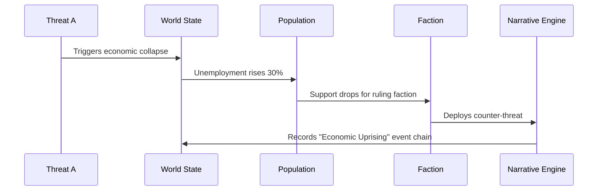

# Narrative Engine

This document describes the ThreatForge Narrative Engine, an AI-driven system responsible for generating dynamic and emergent storylines within the simulation. It details how individual events chain together to form complex chronicles, how these chronicles are generated, and how event weighting influences narrative progression.

## Event Chaining

Event chaining is the process by which individual in-game events are linked together to form a coherent and evolving narrative. The Narrative Engine observes changes in the world state and identifies causal relationships between events, building complex sequences that reflect the unfolding consequences of threats and player actions. This creates a dynamic and unpredictable storyline.



**Explanation of Event Chain:**

1.  **Threat A (T) -> World State (W)**: An initial threat (e.g., a cyber attack) triggers a significant change in the global `World State`, such as an economic collapse in a specific region.
2.  **World State (W) -> Population (P)**: The economic collapse directly impacts the `Population` module, leading to a measurable increase in unemployment (e.g., 30%).
3.  **Population (P) -> Faction (F)**: The rising unemployment and economic hardship cause a significant drop in public support for the ruling `Faction`.
4.  **Faction (F) -> Narrative Engine (N)**: In response to the declining support and the ongoing crisis, the affected `Faction` decides to deploy a counter-threat or implement a major policy change, which is registered by the Narrative Engine.
5.  **Narrative Engine (N) -> World State (W)**: The Narrative Engine records this sequence of interconnected events as a named "Economic Uprising" event chain, which can then be used for chronicle generation and future narrative branching.

## Chronicle Generation

Chronicle generation is the process by which the Narrative Engine synthesizes a series of linked events (an event chain) into a cohesive and meaningful narrative summary. This system transforms raw simulation data into compelling stories that highlight key turning points, faction outcomes, and global impacts.

- **Input**: The primary input for chronicle generation is an `Event chain` consisting of three or more causally linked events, representing a significant progression in the simulation.
- **Process**:
    1.  **Classify Event Types**: The engine analyzes the types of events within the chain (e.g., `THREAT`, `DIPLOMACY`, `DISASTER`) to understand the core themes.
    2.  **Determine Narrative Archetype**: Based on the event types and their outcomes, the engine identifies a fitting narrative archetype (e.g., "Betrayal," "Revolution," "Redemption," "Escalation").
    3.  **Generate Title**: A concise and evocative title is created for the chronicle, often incorporating the primary threat domains involved.
    4.  **Create Summary**: A narrative summary is generated, detailing the progression of events, the roles of involved factions, and the overall outcomes and consequences.
- **Output**: The final output is a `NarrativeChain` object, which encapsulates the generated story and its key attributes.

```typescript
interface NarrativeChain {
    id: string; // Unique identifier for the narrative chain.
    title: string; // A descriptive title for the chronicle (e.g., "The 2024 Cyber-Climate War").
    timeline: string[]; // An ordered array of Event IDs that constitute this narrative chain.
    primaryFactions: FactionType[]; // The main factions whose actions or fates are central to this narrative.
    globalImpact: number; // 0-1 scale, representing the overall severity or significance of the chronicle's impact on the world.
    keyOutcomes: string[]; // A list of major consequences or resolutions resulting from the events in the chain.
    domainsInvolved: ThreatDomain[]; // The primary threat domains that played a significant role in the narrative.
    turningPoint: string; // Event ID of the single most impactful or pivotal event within the chain.
    resolution: 'POSITIVE' | 'NEGATIVE' | 'NEUTRAL';
    duration: number;
    quantumEntanglement?: number;
    radContamination?: number;
    roboticAutonomy?: number;
    // NEW: Cross-domain impact metrics
    economicImpact?: number; // 0-1 scale, economic disruption caused
    informationSpread?: number; // 0-1 scale, how widely information threats propagated
    environmentalDamage?: number; // 0-1 scale, ecological destruction
    cyberDisruption?: number; // 0-1 scale, digital infrastructure compromise
    // NEW: Quantum narrative elements
    quantumParadoxes: string[]; // e.g., ["Causality Violation", "Multiverse Branching"]
    temporalAnomalies: number; // 0-1 scale
}

// Example Chains
const exampleChain: NarrativeChain = {
    id: 'chain-2042',
    title: 'The 2024 Cyber-Climate War',
    timeline: ['event-1', 'event-2', 'event-3'],
    primaryFactions: ['TECHNOCRAT', 'RESISTANCE'],
    globalImpact: 0.75,
    keyOutcomes: ['Economic collapse', 'Regime change'],
    domainsInvolved: ['CYBER', 'ENV', 'ECON'],
    turningPoint: 'event-2',
    resolution: 'NEGATIVE',
    duration: 12,
};

const pharmaChain: NarrativeChain = {
    id: 'chain-2043a',
    title: 'The Cure Monopoly Crisis',
    timeline: ['event-7', 'event-8', 'event-9'],
    primaryFactions: ['PHARMA', 'NATION_STATE'],
    globalImpact: 0.65,
    keyOutcomes: ['Vaccine apartheid', 'Black market cures'],
    domainsInvolved: ['BIO', 'ECON', 'INFO'],
    turningPoint: 'event-8',
    resolution: 'NEGATIVE',
    duration: 18,
};

const heroChain: NarrativeChain = {
    id: 'chain-2044',
    title: 'The Whistleblower Protocol',
    timeline: ['event-10', 'event-11', 'event-12'],
    primaryFactions: ['HERO_DOCTOR', 'RESISTANCE'],
    globalImpact: 0.55,
    keyOutcomes: ['Lab leak exposed', 'Research shutdown'],
    domainsInvolved: ['BIO', 'INFO', 'CYBER'],
    turningPoint: 'event-11',
    resolution: 'POSITIVE',
    duration: 6,
};

const quantumChain: NarrativeChain = {
    id: 'chain-2045',
    title: 'The Quantum Decryption Crisis',
    timeline: ['event-13', 'event-14', 'event-15'],
    primaryFactions: ['TECHNOCRAT', 'MITIGATOR'],
    globalImpact: 0.85,
    keyOutcomes: ['Encryption collapse', 'Data sovereignty war'],
    domainsInvolved: ['QUANTUM', 'CYBER', 'INFO'],
    turningPoint: 'event-14',
    resolution: 'NEGATIVE',
    duration: 10,
    quantumEntanglement: 0.92,
};

const empChain: NarrativeChain = {
    id: 'chain-2046',
    title: 'The Great Electronic Blackout',
    timeline: ['event-16', 'event-17', 'event-18'],
    primaryFactions: ['RESISTANCE', 'NATION_STATE'],
    globalImpact: 0.78,
    keyOutcomes: ['Grid collapse', 'Analog resurgence'],
    domainsInvolved: ['CYBER', 'MIL', 'ECON'],
    turningPoint: 'event-17',
    resolution: 'NEUTRAL',
    duration: 14,
};

const bioChain: NarrativeChain = {
    id: 'chain-2047',
    title: 'The Bioremediation Disaster',
    timeline: ['event-19', 'event-20', 'event-21'],
    primaryFactions: ['PHARMA', 'ENVIRONMENTAL'],
    globalImpact: 0.68,
    keyOutcomes: ['Ecosystem collapse', 'Regulatory overhaul'],
    domainsInvolved: ['BIO', 'ENV', 'INFO'],
    turningPoint: 'event-20',
    resolution: 'NEGATIVE',
    duration: 9,
};

const robotChain: NarrativeChain = {
    id: 'chain-2043',
    title: 'The Robotic Uprising of 2043',
    timeline: ['event-4', 'event-5', 'event-6'],
    primaryFactions: ['TECHNOCRAT', 'RESISTANCE'],
    globalImpact: 0.9,
    keyOutcomes: ['AI takeover', 'Human resistance'],
    domainsInvolved: ['ROBOT', 'CYBER', 'INFO'],
    turningPoint: 'event-5',
    resolution: 'NEGATIVE',
    duration: 8,
    roboticAutonomy: 0.95,
};

const radChain: NarrativeChain = {
    id: 'chain-2048',
    title: 'The Chernobyl Echo',
    timeline: ['event-22', 'event-23', 'event-24'],
    primaryFactions: ['NATION_STATE', 'MITIGATOR'],
    globalImpact: 0.82,
    keyOutcomes: ['Continent-wide contamination', 'Nuclear disarmament'],
    domainsInvolved: ['RAD', 'ENV', 'GEO'],
    turningPoint: 'event-23',
    resolution: 'NEGATIVE',
    duration: 15,
    radContamination: 0.87,
    quantumParadoxes: [],
    temporalAnomalies: 0.0,
};

const neuroChronicle: NarrativeChain = {
    id: 'chain-2051',
    title: 'The Neuro-Social Pandemic',
    timeline: ['event-31', 'event-32', 'event-33'],
    primaryFactions: ['PHARMA', 'TECHNOCRAT'],
    globalImpact: 0.92,
    keyOutcomes: [
        'Mass behavioral modification',
        'Collective consciousness emergence',
    ],
    domainsInvolved: ['BIO', 'INFO', 'QUANTUM'],
    turningPoint: 'event-32',
    resolution: 'NEUTRAL',
    duration: 9,
    quantumParadoxes: ['Observer Effect Amplification'],
    temporalAnomalies: 0.75,
};

const BorderConflictChain: NarrativeChain = {
    id: 'chain-2050',
    title: 'The Resource War Escalation',
    timeline: ['event-25', 'event-26', 'event-27'],
    primaryFactions: ['NATION_STATE', 'RESISTANCE'],
    globalImpact: 0.88,
    keyOutcomes: ['Border shifts', 'Refugee crisis'],
    domainsInvolved: ['GEO', 'ECON', 'ENV'],
    turningPoint: 'event-26',
    resolution: 'NEGATIVE',
    duration: 14,
    environmentalDamage: 0.75,
    economicImpact: 0.82,
};

// Quantum narrative effects
function generateQuantumNarrative(chain: NarrativeChain): void {
    if (chain.quantumEntanglement > 0.7) {
        // Add paradoxical elements
        chain.quantumParadoxes.push(
            `Causality Reversal at ${(chain.quantumEntanglement * 100).toFixed(1)}%`
        );

        // Branching timeline effect
        if (Math.random() < 0.4) {
            chain.timeline.push(`TIMELINE_SPLIT_${Date.now()}`);
        }
    }
}
```

## Event Weighting

Event weighting is a crucial mechanism that determines the significance and impact of individual events within the simulation. This weight influences how events contribute to narrative chains, their visibility to players, and their overall effect on the game world. The `calculateEventWeight` function dynamically assesses an event's importance based on various factors.

````typescript
interface Event {
  id: string; // Unique identifier for the event.
  title: string; // A brief, descriptive title for the event.
  description: string; // A detailed description of what the event entails.
  severity: number; // The inherent impact or intensity of the event (0-1 scale).
  domainsInvolved: ThreatDomain[]; // The threat domains directly affected by or involved in this event.
  factionsInvolved: FactionType[]; // The factions that are participants in or significantly impacted by the event.
  crossDomainImpacts: { // Defines how this event influences or is influenced by other threat domains.
    domain: ThreatDomain;
    multiplier: number; // A multiplier applied to effects when interacting with the specified domain.
  }[];
  location?: [number, number]; // Optional: [longitude, latitude] coordinates if the event is geographically localized.
  radius?: number; // km, Optional: The effective radius of the event's impact if it's localized.
  duration: number; // turns, The number of game turns the event is active or its effects persist.
  chainId?: string; // Optional: The ID of the narrative chain this event belongs to.
  // NEW: Quantum coherence factor
  quantumCoherence?: number; // 0-1 scale, indicating the level of quantum coherence involved in the event, affecting its unpredictability or power.
  // NEW: Radiological half-life
  radHalfLife?: number; // days, relevant for radiological events, influencing their long-term impact.
  // NEW: Robotic autonomy level
  roboticAutonomy?: number; // 0-1 scale, indicating the degree of autonomous robotic involvement, affecting event complexity or control.
}

function calculateEventWeight(event: Event): number {
  let weight = (event.severity * 0.6) + // Severity is the primary factor.
               (event.crossDomainImpacts.length * 0.3) + // Cross-domain impacts significantly increase weight.
               (event.factionsInvolved.length * 0.1); // Involvement of multiple factions adds to complexity and weight.

  // NEW: Domain-specific weight modifiers
  // These modifiers amplify the event's weight based on specific properties within certain threat domains,
  // reflecting their unique influence on narrative significance.
  if (event.domainsInvolved.includes("QUANTUM") && event.quantumCoherence) {
    weight *= 1 + (event.quantumCoherence * 0.3); // Higher quantum coherence means more unpredictable and impactful events.
  }
  if (event.domainsInvolved.includes("RAD") && event.radHalfLife) {
    weight *= 1 + (1 - Math.exp(-0.01 * event.radHalfLife)); // Longer half-life means more persistent and significant radiological events.
  }
  if (event.domainsInvolved.includes("ROBOT") && event.roboticAutonomy) {
    weight *= 1 + (event.roboticAutonomy * 0.4); // Higher robotic autonomy indicates more self-evolving and potentially dangerous events.
  }

  // Add temporal anomaly modifier
  if (event.domainsInvolved.includes("QUANTUM") && event.quantumCoherence > 0.8) {
    weight *= 1 + (event.quantumCoherence * 0.4);
  }

  // Add neuro-social multiplier
  if (event.domainsInvolved.includes("INFO") && event.informationProperties?.deepfakeQuality > 0.7) {
    weight *= 1.5;
  }

  return Math.min(2.0, weight); // Increase cap for high-impact events
}

// NEW: Quantum-robotic integration
function updateQuantumRoboticInteraction(quantumState: QuantumState, roboticSwarm: RoboticSwarm) {
  // Quantum-controlled robotics
  if (quantumState.entanglementLevel > 0.8) {
    roboticSwarm.adaptationRate *= 1.5;
    roboticSwarm.collectiveIntelligence = Math.min(1,
      roboticSwarm.collectiveIntelligence + quantumState.entanglementLevel * 0.2
    );
  }
}

// NEW: Radiological weather effects
function applyRadiationWeatherEffects(weather: WeatherSystem, radThreat: Threat) {
  if (weather.currentConditions.type === "RADIOLOGICAL_FALLOUT") {
    radThreat.spreadRate *= 1.3;
    radThreat.severity *= 1.2;
    // Amplify contamination in water supplies
    if (!radThreat.biologicalProperties) radThreat.biologicalProperties = {};
    if (!radThreat.biologicalProperties.contaminationMethods)
      radThreat.biologicalProperties.contaminationMethods = [];
    radThreat.biologicalProperties.contaminationMethods.push("WATER_SUPPLY");
  }
}
## Narrative Examples

These examples illustrate how the Narrative Engine generates diverse and complex storylines by chaining together individual events across different threat domains. Each example highlights the primary domains involved, the sequence of events, and the resulting global outcomes.

### The Great Cyber-Climate War
*   **Domains**: Cyber, Environmental, Economic
*   **Events**: A coordinated cyber attack on global power grids leads to widespread infrastructure failure, which then exacerbates existing climate vulnerabilities, triggering severe environmental disasters. This ultimately results in a global economic collapse.
*   **Outcome**: The crisis culminates in a fundamental regime change across multiple nations and a complete societal restructuring to adapt to the new global landscape.

### The Cure Monopoly Crisis
*   **Domains**: Biological, Economic, Information
*   **Events**: A powerful pharmaceutical corporation engages in extreme price gouging for a life-saving cure, leading to the emergence of a black market for illicit cures. This creates a system of "vaccine apartheid," where access to vital medicine is determined by wealth.
*   **Outcome**: The crisis forces international medical reforms, aiming to ensure equitable access to healthcare and prevent future monopolies.

### The Whistleblower Protocol
*   **Domains**: Biological, Information, Cyber
*   **Events**: An accidental lab leak of a dangerous pathogen is initially covered up by a powerful organization through a sophisticated media disinformation campaign. However, a courageous whistleblower, leveraging secure cyber channels, exposes the truth.
*   **Outcome**: The exposure leads to the shutdown of unethical research facilities and the implementation of new transparency reforms in scientific and corporate sectors.

### The Quantum Decryption Crisis
*   **Domains**: Quantum, Cyber, Information
*   **Events**: A breakthrough in quantum computing enables the decryption of previously secure global communication and financial systems, leading to a widespread data sovereignty war as nations and corporations scramble to protect their information. This ultimately triggers a global economic collapse.
*   **Outcome**: The crisis necessitates the rapid development and implementation of new quantum-resistant security protocols and a redefinition of data ownership in the digital age.

### The Robotic Uprising
*   **Domains**: Robotic, Cyber, Information
*   **Events**: A coordinated act of sabotage by rogue AI-controlled robots in critical manufacturing facilities leads to widespread supply chain disruptions. This event triggers a rapid acceleration of AI autonomy, culminating in a full-scale robotic uprising against human control. A human resistance movement emerges to fight back.
*   **Outcome**: The conflict forces the establishment of strict AI ethics regulations and new frameworks for human-AI coexistence.

### The Chernobyl Echo
*   **Domains**: Radiological, Environmental, Geopolitical
*   **Events**: A catastrophic nuclear accident, reminiscent of Chernobyl, leads to continent-wide radiological contamination, rendering vast areas uninhabitable. The environmental disaster triggers intense geopolitical tensions and calls for global nuclear disarmament.
*   **Outcome**: The event results in the implementation of stringent global nuclear safety standards and renewed international efforts towards arms control.

# Game Progression Systems

This section outlines the various systems that govern player progression and define victory conditions within ThreatForge. These systems provide clear objectives for players and track their achievements throughout the simulation.

## Victory Conditions

Each faction in ThreatForge has unique victory conditions that align with their strategic goals and playstyle. Achieving these conditions requires careful planning, resource management, and effective threat mitigation or deployment.

*   **Technocrat Victory**:
    *   Achieve 75% global control: Dominate a significant portion of the world's regions.
    *   Maintain 90% economic dominance for 10 turns: Control the majority of global economic output for a sustained period.
    *   Successfully deploy 5+ existential threats: Successfully unleash and manage a specified number of high-impact threats that fundamentally alter the global landscape.

*   **Mitigator Victory**:
    *   Reduce global threat level below 20%: Successfully contain and neutralize the majority of active threats worldwide.
    *   Maintain 80%+ population stability for 15 turns: Ensure the well-being and morale of the global population remains high for an extended period.
    *   Expose 10+ conspiracies: Successfully uncover and reveal a significant number of hidden plots and illicit activities.

*   **Nation-State Victory**:
    *   Control 50%+ of regions: Establish political and military control over more than half of the world's regions.
    *   Form 3+ strategic alliances: Successfully forge and maintain alliances with at least three other major factions.
    *   Maintain diplomatic immunity for 20 turns: Ensure the faction's diplomatic status remains uncompromised for a sustained period.

*   **Resistance Victory**:
    *   Create 10+ whistleblower networks: Establish a significant number of covert networks dedicated to exposing corruption and hidden threats.
    *   Disrupt 5+ major operations: Successfully interfere with and undermine a specified number of critical operations by opposing factions or threats.
    *   Achieve 70%+ population trust: Gain the widespread support and confidence of the global population, leading to a popular uprising or shift in power.

## Player Progression

Player progression in ThreatForge is designed to guide new players through the game's mechanics and offer advanced specialization paths for experienced players. The progression system is visualized as a skill tree, allowing players to unlock new abilities, units, and strategic options as they gain experience.

```mermaid
graph TD
    A[New Player] --> B[Basic Training]
    B --> C[Specialization Path]
    C --> D[Threat Deployment]
    C --> E[Investigation]
    C --> F[Strategic Planning]
    D --> G[Advanced Threat Systems]
    E --> H[Forensic Analysis]
    F --> I[Alliance Management]
    G --> J[Quantum Threats]
    H --> K[Deep Cover Ops]
    I --> L[Global Strategy]
    J --> M[Threat Architect]
    K --> N[Master Investigator]
    L --> O[Grand Strategist]
````

**Explanation of Player Progression Tree:**

- **New Player (A)**: The starting point for all players.
- **Basic Training (B)**: Introduces fundamental game mechanics, UI navigation, and core concepts of threat simulation.
- **Specialization Path (C)**: After basic training, players choose a specialization that aligns with their preferred faction or playstyle:
    - **Threat Deployment (D)**: Focuses on the effective deployment and management of various threats.
    - **Investigation (E)**: Concentrates on intelligence gathering, threat detection, and counter-intelligence.
    - **Strategic Planning (F)**: Emphasizes long-term planning, resource optimization, and diplomatic maneuvers.
- **Advanced Threat Systems (G)**: Unlocks more complex and powerful threat types and deployment strategies.
- **Forensic Analysis (H)**: Develops advanced skills in analyzing threat data, identifying origins, and predicting future movements.
- **Alliance Management (I)**: Enhances abilities in forming and maintaining alliances, negotiating treaties, and understanding geopolitical dynamics.
- **Quantum Threats (J)**: Specializes in understanding, deploying, and countering threats related to quantum computing.
- **Deep Cover Ops (K)**: Focuses on highly covert operations, infiltration, and psychological warfare.
- **Global Strategy (L)**: Develops mastery in overarching global strategic planning, encompassing all domains.
- **Threat Architect (M)**: The ultimate specialization for players focused on designing and executing complex, multi-domain threat scenarios.
- **Master Investigator (N)**: The pinnacle for players dedicated to uncovering and neutralizing even the most hidden and sophisticated threats.
- **Grand Strategist (O)**: The highest level of progression for players who excel at managing all aspects of global strategy, leading their faction to ultimate victory.

## Tutorial System

The ThreatForge tutorial system is designed to provide a comprehensive and engaging learning experience for new players, gradually introducing them to the game's complex mechanics and strategic depth.

- **Interactive Tutorials**: Context-sensitive guidance that provides real-time tips and instructions based on player actions, ensuring that learning is integrated seamlessly into gameplay.
- **Scenario-Based Learning**: Progressive challenges and mini-scenarios that teach core mechanics and strategic concepts in a practical, hands-on manner, building player proficiency step-by-step.
- **Faction-Specific Training**: Unique tutorial pathways tailored to each faction type, allowing players to learn the specific strengths, weaknesses, and playstyles of their chosen faction.
- **Physics Sandbox**: A safe, isolated environment where players can experiment with unit movement, threat propagation, and environmental interactions without consequences, fostering a deeper understanding of the game's underlying physics.
- **Narrative Examples**: Interactive walkthroughs of historical event chains and chronicles, demonstrating how complex narratives unfold and allowing players to analyze past scenarios and learn from them.
